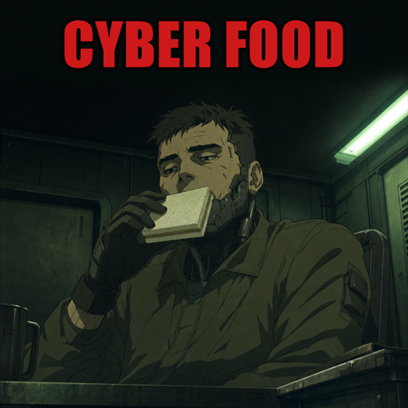
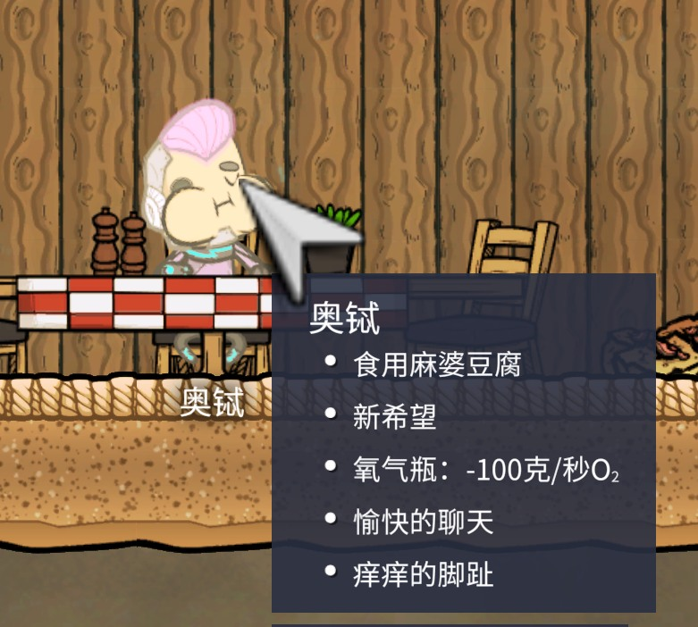
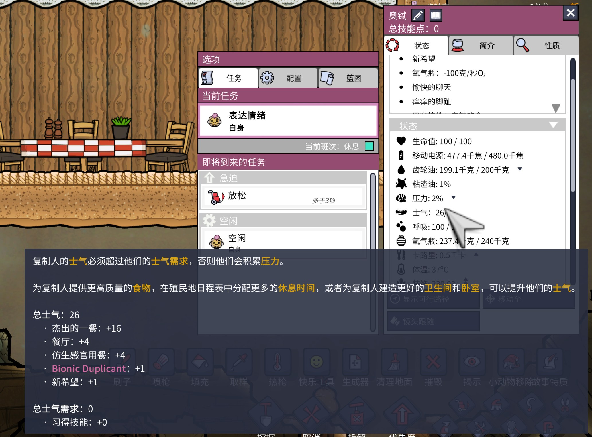

# Cyber Food / 仿生感官用餐



[Steam Workshop](https://steamcommunity.com/sharedfiles/filedetails/?id=3773930750)
· [GitHub source](https://github.com/yufeiran/CyberFoodONI)

Cyber Food lets Bionic Duplicants consume a small tasting portion of ordinary
food for morale. They do not need the calories—they simply miss the experience.

Cyber Food 允许仿生人品尝少量普通食物来获得士气。食物不为他们供能；他们只是想念
味道、气味、口感，以及和同伴一起吃饭的感觉。

> 仿生人坚持认为，它不是在浪费食物，而是在进行高精度感官校准。
>
> Bionic Duplicants insist that this is not wasting food, but high-precision
> sensory calibration.

## Features / 功能

- Bionic Duplicants can enable ordinary foods in the Consumables screen.
- When the effect is absent, they seek permitted, reachable food during a
  schedule block that allows eating.
- Each dining experience consumes **200 kcal** of ordinary food.
- It grants **+4 morale for 3 cycles**.
- The effect does not stack. Eating again becomes necessary only after it
  expires.
- Version 1.1 adds two independent global options for original food effects
  and dining-room effects. Both are disabled by default to preserve the
  original Cyber Food balance.
- Standard Duplicants keep the original game behavior.
- No new building, recipe, artwork or library dependency is required.

中文说明：

- 可在“饮食”界面为仿生人允许普通食物。
- 没有感官用餐效果时，仿生人会在允许进食的日程时段寻找可达食物。
- 每次只消耗 **200 千卡**。
- 获得 **+4 士气，持续 3 周期**。
- 效果不会叠加；三周期结束后才会再次进食。
- 1.1 版新增“原版食物效果”和“餐厅效果”两个独立全局选项；默认均关闭，
  以保持原有平衡。
- 不改变普通复制人的进食机制。

## Options / 设置

Open ONI's **Mods** screen, select **Cyber Food**, and press **Manage** to
change either option. Changes are saved to
`mods/config/CyberFoodONI.json` and apply to future meals without restarting.

- **Original food effects**: allows food quality morale, spices, garnish and
  food-specific effects.
- **Dining room effects**: allows Mess Hall and Great Hall meal effects.
- Enabled bonuses stack with Cyber Food's own **+4 morale for 3 cycles**.
- For Bionic Duplicants, enabled food-quality, spice, garnish,
  food-specific and dining-room effects are synchronized to **3 cycles**.

在《缺氧》的 **Mod** 界面中选择 **Cyber Food**，点击 **管理**即可切换两个
选项。设置保存在 `mods/config/CyberFoodONI.json`，无需重启，从下一次进餐开始
生效。

- **原版食物效果**：允许食物品质士气、香料、装饰配菜和菜品自带效果。
- **餐厅效果**：允许食堂和高档餐厅的进餐效果。
- 开启后的加成会与 Cyber Food 自带的 **+4 士气 / 3 周期**叠加。
- 对仿生人而言，开启后的食物品质、香料、装饰配菜、菜品和餐厅效果都会统一
  持续 **3 周期**。

### Version 1.1 in game / 1.1 实机效果





Gunk production is deliberately not included in this MVP.

## Inspiration / 灵感来源

The idea was inspired by the treatment of cyborg food and remembered sensory
experience in *Ghost in the Shell*—most directly
*Ghost in the Shell: S.A.C. 2nd GIG*, episode 8,
“Vegetarian Dinner / FAKE FOOD.”

In that episode, Togusa accidentally bites a sandwich intended for cyborgs.
Batou explains that a cybernetic brain can still crave remembered tastes, which
is why novelty food exists for people with prosthetic bodies. This is the
specific scene behind this mod's “food as experience rather than survival”
design.

One small correction to the memory that started the project: Major Motoko
Kusanagi participates in the operation remotely, but she is not the character
eating in this scene. The food exchange is primarily between Togusa and Batou.

References:

- [Official Ghost in the Shell: Stand Alone Complex series page](https://theghostintheshell.jp/en/series/stand_alone_complex)
- [Episode 8 listing and synopsis](https://www.adultswim.com/videos/ghost-in-the-shell/stand-alone-complex)
- [English subtitle transcript for the relevant food discussion](https://subtitlecat.com/subs/1151/Ghost%20in%20the%20Shell%20%28S.A.C%29%20-%20S02%20E08%20-%20DI%20-%20Fake%20Food%20%281080p%20Proper%20-%20DUAL%20Audio%29.html)

Cyber Food is an unofficial fan-made mod. It is not affiliated with Klei,
Kodansha, Production I.G, or the *Ghost in the Shell* rights holders, and
contains no assets from *Ghost in the Shell*.

## Installation / 安装

The **Bionic Booster Pack** is required.

1. Subscribe on Steam Workshop and enable **Cyber Food** in ONI's Mods menu.
2. Restart the game when prompted.
3. Open the Consumables screen and permit at least one ordinary food for each
   Bionic Duplicant.
4. Use a schedule containing a Recreation block, or another block that permits
   eating.

## Compatibility

This version was built and tested against ONI U59 build 744825. It patches the
current `BionicMinionConfig`, `CalorieMonitor`, `ConsumerManager`, `EatChore`
and `Edible` APIs. A future ONI update that changes those APIs may require a
rebuild.

## Build from source

Open `CyberFoodONI.sln` in Visual Studio and build `Debug` or `Release`.

The project currently defaults to:

```text
E:\SteamLibrary\steamapps\common\OxygenNotIncluded
```

If ONI is installed elsewhere, set the MSBuild property `OniInstallPath`:

```powershell
dotnet build .\CyberFoodONI.sln -c Release `
  /p:OniInstallPath="D:\SteamLibrary\steamapps\common\OxygenNotIncluded"
```

The ready-to-install output is written to:

```text
artifacts\CyberFoodONI
```

Copy that directory to ONI's `mods\local` directory.

## Workshop artwork

- Upload-ready preview: `workshop/preview.png` — 512×512 PNG, under 1 MiB.
- High-resolution source: `workshop/cyber-food-cover-v2-source.png`.
- Text-free source: `workshop/cyber-food-cover-v2-base.png`.

The artwork is original and AI-generated for this project. It intentionally
uses no *Oxygen Not Included* or *Ghost in the Shell* characters, logos, or
extracted assets.
